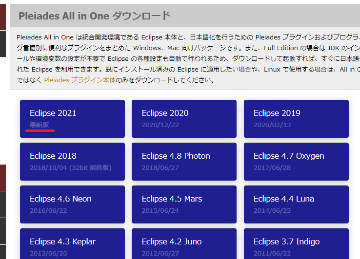
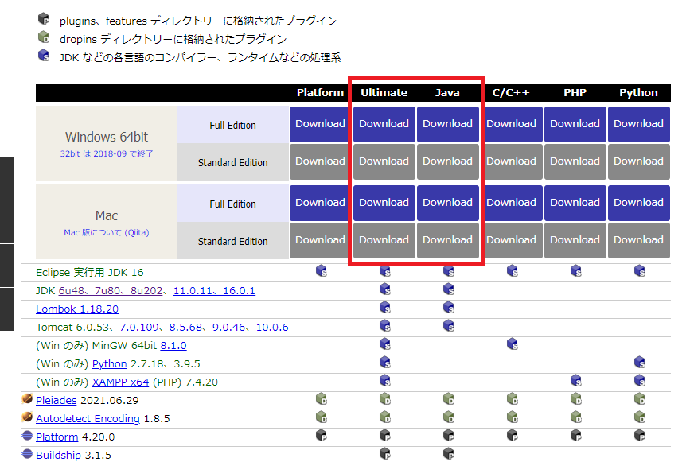
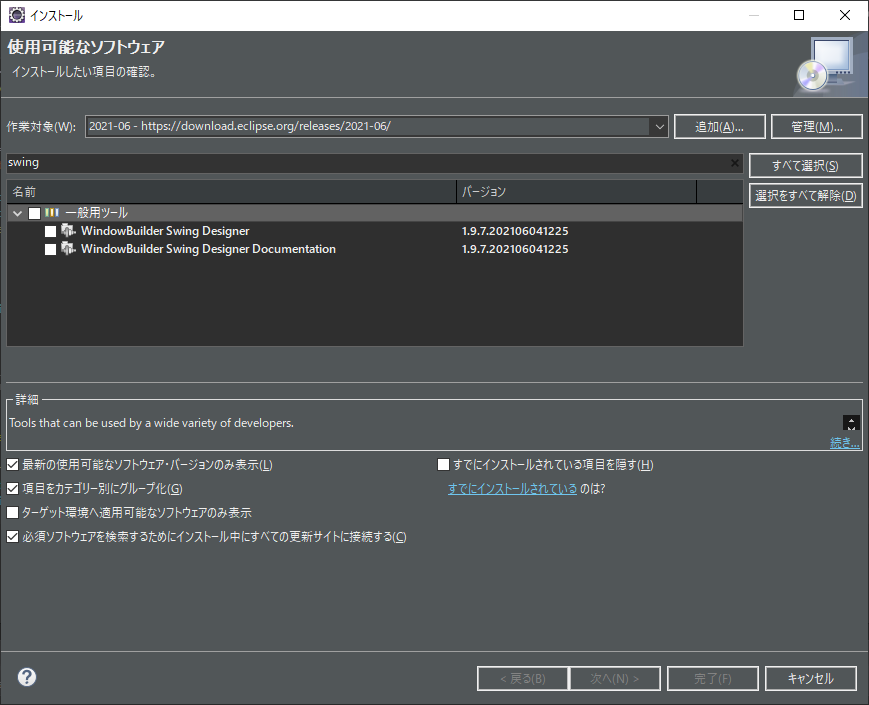
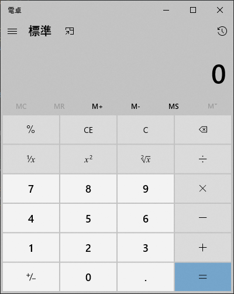
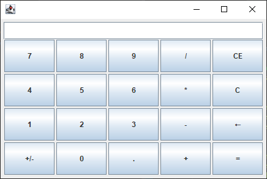
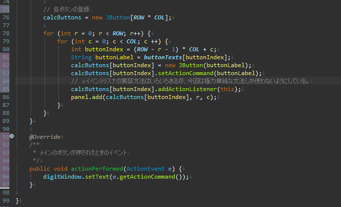
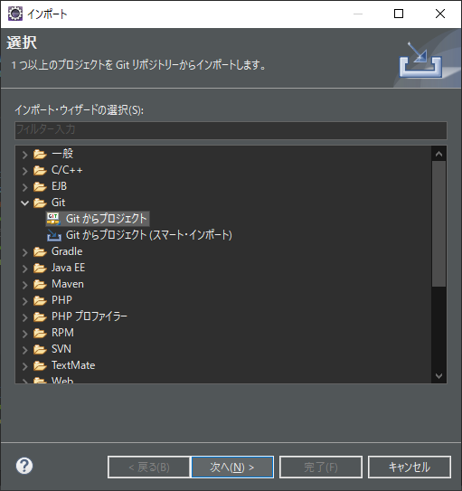
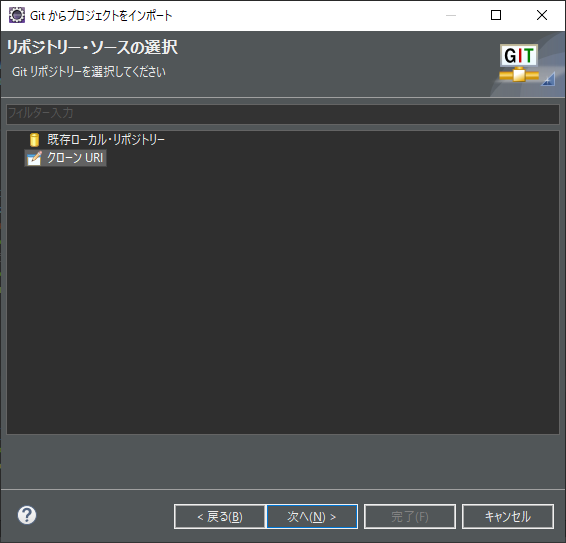
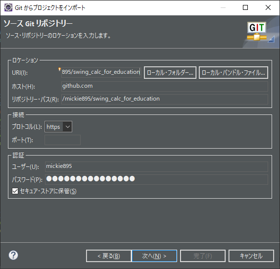
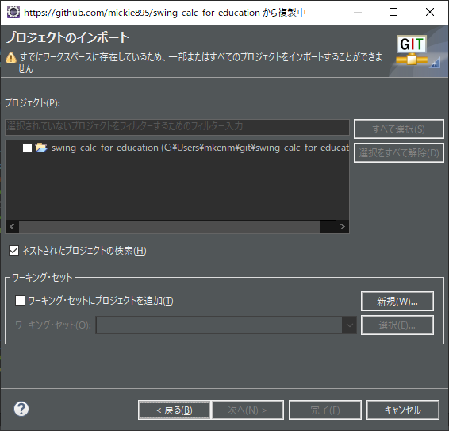

# Javaでアプリを開発する

## 目次
* 基礎知識
* 開発環境の構築
* 課題
  * ストレッチゴール
* 参考文献

----

## 基礎知識
* Java言語とは
* なんで「オブジェクト指向」？
* プログラム複雑化の例：ポケモン

----

## Java言語とは
* 現在メジャーな開発言語の一つ
  * 有名ドコロだとMinecraftとかで使われている。
  * OSや環境にとらわれないソフトが作れる。
    * ただしOSの標準に合わせた統一感のあるUIは難しい。
  * C++をベースに*オブジェクト指向*の考え方でプログラムを作る。
* JavaScriptとは関係ない

文法については各自で参考図書などで勉強してみてください。

確か社内にも参考書があったはずです。

----

## なんでオブジェクト指向？
### オブジェクト指向のメリット
* プログラムが複雑になっても管理しやすくなる
  * 考えなくて良い部分を増やせばそれだけ管理が楽になる
  * 新しい機能の作成が楽になる
* 「複雑になる」例は？
  * ポケモン
  * 赤緑(25年前)とソード・シールド(2年前)を比較する

----

## ポケモンで見るプログラムの複雑さ
### 初代ポケモン
#### ポケモンのステータス
  * 種族値
  * 個体値
  * 努力値

#### ポケモンのわざ
  * 威力
  * 命中
  * PP
  * 特殊効果(一撃必殺、ステータス変化etc...)

----

## ポケモンで見るプログラムの複雑さ
### 現在のポケモン
#### ポケモンのステータス
* 種族値
* 個体値
* 努力値
* なつき値
* 性別
* 特性
* 性格
* もちもの
* メガシンカ先
* キョダイマックス先
* ……

#### ポケモンのわざ
* 威力
* 命中
* PP
* 特殊効果(一撃必殺、ステータス変化etc...)
* Z技化
* 大マックス技化
* キョダイマックス技化
* ……

----

## 開発環境の構築
### 手順
* 開発環境の選定
* GUI作成ツールの選択
* Eclipseの環境構築
  * Eclipse本体のインストール
  * Swingのインストール

----

## 利用可能な開発環境の選定
### 候補
* Eclipse
  * 無料
  * 20年前に開発が始まったソフトのため、過去を引きずって使いづらいこともある
  * インストーラが巨大
  * 一応デファクトスタンダード
  * 日本語化情報も豊富
  * どれだけスペックが高くても動作が重い(気がする)
* IntelliJ IDEA
  * 本格的に使おうとしたら有料
  * 比較的新しいIDEのため、使いやすい
  * 無料版で日本語化できるかは不明
* Visual Studio Community Edition(参考)
  * 個人利用であれば無料
  * IDE周りもある程度洗練されている。
  * 日本語も対応
  * そもそも使える言語がJavaじゃなくてC#
    * 個人的にはC#の方が使いやすいと思う。

今回は**Eclipse**を使用する

----

## GUI作成ツールの選択
### JavaのGUI作成ツール候補
* Java FX
* Swing

### Swingを選択
* 古いフレームワークではあるが、GUIの動作がわかりやすいため
* オブジェクト指向とイベントでGUIを作る
  * .Net FrameworkやAndroidのネイティブアプリでも同様の考え方がされる

----

## Eclips本体のインストール
### All in Oneをインストールしよう
* 下記アドレスにアクセスしてダウンロード
* https://mergedoc.osdn.jp/
* 最新版→Full Edition→Ultimateを選択すればOK
  * TODO：Chrome OSでの開発環境構築方法調査
* 適当な場所に展開して起動する
  * ```pleiades\eclipse\eclipse.exe```

----





----

## Swingのインストール
### インストール方法
* eclipseを起動したらヘルプ→新規ソフトウェアのインストールを選択
* 作業対象から一番新しい月のアドレス(多分画面と一緒)を選択
* swingと書かれたツール(両方)をインストール



----

## 課題

----

## 電卓を作ってみよう
### 電卓とは？
*  ユーザがボタンから数値を入力し、計算するシステム
*  ……説明いる？
*  WindowsならWindowsキーとRキーを押して、calcって入力してEnterを押せばいいと思う。



----

## 選べる難易度
### いくつか難易度を用意してみました。
* 超初心者級
* 初心者級
* 中級者級
* オブジェクト指向プログラマ級
* 無駄に全力級

----

## 要求仕様
### 今回の要求事項
* 整数4桁の四則演算ができる(～初心者)
  * 整数9桁の四則演算ができる(中級者～)
  * 小数の四則演算ができる(追加ゴール)
* 2つの数値だけ考えれば良いので四則演算の優先度は考えない
* 適切なエラー処理を考えること(何がエラーになるか考えてみよう)

----

## 超初級者用スターターキット
### githubにスターターキットを用意
* ボタンとテキストボックスを準備
  * ボタンを押すとテキストボックスに文字を表示

ある程度自分で頑張りたい人はUIの設計から自分でやってみよう



----

## スターターキットの動作
### ボタンとイベント
* Swingは「イベントドリブン」という考え方でGUIの部品を実装する。
* スターターキットのボタンは次のような考え方で実装している。
  1. ウィンドウを作るクラスに「ボタンを押したときの動作(ActionListener)」を実装する
  2. ボタンを作り、「ボタンを押したときに発生させるイベント一覧」にウィンドウを登録する
  3. ボタンを押したとき、登録されているイベントリスナでイベントの処理を行う
       * ウィンドウクラスで実装したactionPerformedメソッド

----

## イベントドリブン？
### なんでこんな作り？
* **ボタンが覚えているのは、「メインウィンドウ」ではなく、「イベントを受け取ってくれるオブジェクト」**
  * ボタン自体は「イベントの送り先のクラス名やウィンドウのレイアウト」などの余計な情報は知っていない
  * 不要な情報を与えないことがプログラムを強くする
  * 逆に不要な情報を知っていると、「キッチンのコンロの火を止めるスイッチが隣の家にある」ような不安定な構造になりやすい
    * 例：データベースから値を読み取りファイルに書き込むプログラムに値チェックの処理を追加したら、値を読み込むクラスとファイルに書き込むクラスとGUIを変更しなければいけなくなる



----

## スターターキットのダウンロード方法
### gitを使ったダウンロード

* ファイルからインポートを選択
* Gitからプロジェクトを選択
* クローンURIを選択し、[https://github.com/mickie895/swing_calc_for_education.git](https://github.com/mickie895/swing_calc_for_education.git)を記入
  * ※ユーザ名やパスワードは入れなくてOK
* swing_calc_for_educationを選択してインポートする






----

## 現状わかっている詰まりポイント
### 何故かプログラムを実行できない
* プログラムを実行しようとすると次のようなエラーメッセージが出る
* 環境依存と考えられるが原因はわかっていない
* JDKを変更すれば対処できるみたい

```
#
# A fatal error has been detected by the Java Runtime Environment:
#
#  EXCEPTION_ACCESS_VIOLATION (0xc0000005) at pc=0x00007ffb293402ae, pid=25700, tid=15364
#
# JRE version: OpenJDK Runtime Environment (15.0.2+7) (build 15.0.2+7-27)
# Java VM: OpenJDK 64-Bit Server VM (15.0.2+7-27, mixed mode, tiered, compressed oops, g1 gc, windows-amd64)
# Problematic frame:
# C  [awt.dll+0x902ae]
```

### 使えそうな対処法リスト
* エンコーディングを変更する
* JDKを変更する


----

## 追加ゴール及びヒント1
### 整数9桁の四則演算(中級者用)
* 要は「例外を起こさずにint型を表示できるようにする」が目標
* 掛け算の処理に注意

### 小数点の計算について
* 数値をそのままテキストボックスに出力することができなくなる
* 0.0000…を入力したときの挙動を考えよう
* 小数点を使う場合の有効数字はどれぐらいになるだろうか？

----

## 追加ゴール及びヒント2
### オブジェクト指向を意識してみる
* 「計算部分をそのままにWebアプリ化したい」って言われたときにどうする？
  * どのように設計してある必要があるかを考えよう

----

## 追加ゴール及びヒント3
### せっかくだし、もっと全力を出してみる
* エラー処理の確かさをテストケースとして単体テスト化できないだろうか
* せっかくだし計算部分をTDD(テスト駆動開発)で開発してみる
* 「オブジェクト指向エクササイズ」をやってみる
  * 一つのメソッドにインデントは一個まで
  * elseを使わない
  * 文字列、数値をクラスにラップして使用する
  * 一行に使えるドットは一つ
  * 名前は省略しない
  * 1クラス100行未満
  * 一つクラスの変数は2つまで
  * 配列・リストもクラスにラップして使用する
  * getter・setterを使用しない

----

## できればやらないでほしいこと
### 講師のコードを参考にする
* 自分も実装例を作成中
  * 今までの情報から、自分の実装例を見る方法がある
* この資料は参加できなかった人や内容を忘れた人のためにインターネットにアップロード予定
  * 実装方法も日記形式で書く予定なのでできれば見ないでね

----

## 参考文献
### [現場で役立つシステム設計の原則](https://www.amazon.co.jp/gp/product/B073GSDBGT/)
* 「オブジェクト指向エクササイズ」の出典
* プログラムを作るときの基本が分かる本
* この内容を知っていても実際に行動に移せない人が大半なため、実践できるだけで価値がある

### [テスト駆動開発](https://www.amazon.co.jp/dp/B077D2L69C)
* プログラムが持つ「振る舞い」に焦点を当てた開発方法
* 取り上げられている例が今回の電卓と似ているからわかりやすいかも？
* 四則演算のボタンを複数回押したときやCやCEを押したときの挙動をテスト駆動開発で書けるかな？

### [達人プログラマー ―熟達に向けたあなたの旅― 第2版](https://www.amazon.co.jp/gp/product/B08T9BXSVD/)
* 直接は関係ないが読もう
* このスライドもこの本の考え方に従い、markdown言語で書き、gitで管理している
